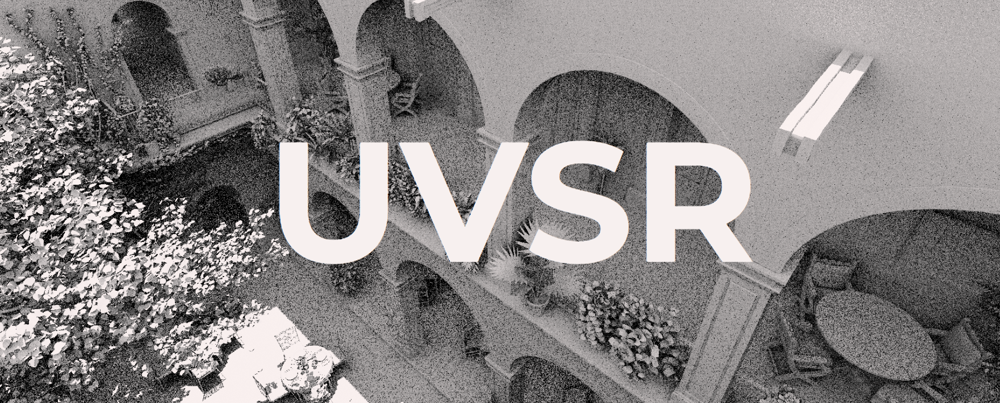

**Unified Visibility Stochastic Rendering Engine**

[](LICENSE.md)
[](#engineering-documentation)


UVSR is a focused DirectX 12 research renderer built on NVIDIA's pinned Donut
framework and NVRHI. It ships with five ready-to-run research scenes, a
production-focused deferred PBR path, and independently testable visibility,
anti-aliasing, shadow, and diagnostic systems.

<!-- uvsr-codebase-size:start -->
**First-Party Lines of Code:** 128,617 non-blank source lines.

**Third-Party Lines of Code:** 386,164 non-blank source lines.

**Total Lines of Code:** 514,781 non-blank source lines.

Counts cover UVSR source, tests, tools, build scripts, retained pinned
dependency source, and final first-party dependency overrides. Documentation,
assets, licenses, binaries, and generated build output are excluded. Regenerate
with `tools/update_readme_line_counts.cmd --write`.
<!-- uvsr-codebase-size:end -->

## Renderer Highlights

- **Visibility Bitmask Diffuse Lighting:** A 32-sector mask converts finite-thickness
  screen-space samples into ambient visibility and one-bounce diffuse
  transport; newly claimed sectors prevent double-counting.
- **Shared DXR Transport:** Material-aware inline ray queries drive selective
  sun, sky, and flashlight visibility plus zero-raster complete path transport
  through the same alpha-tested world representation.
- **Configurable Path Tracing:** A Realtime Path Tracer plus first-party
  clean-room Reservoir Path Tracer seed replay and bounded Reservoir Indirect
  Lighting rough diffuse-tail reconnection
  share one Lambert/GGX transport core with NEE, emissive and environment
  paths, one-to-eight fresh samples per pixel, independently controlled
  temporal and previous-frame spatial reuse, progressive accumulation, an
  optional direct reservoir, and transport debug views. A full-resolution
  Shared Primary Surface can split the direct baseline from indirect transport
  and provide validated ray-traced depth and motion to TAA, avoiding coarse
  disocclusion blocks. The ReSTIR subsets do not claim complete NVIDIA
  namesake or arbitrary full-path reconnection parity.
- **Ratio Estimators:** Correlated visible and unshadowed RGB responses reduce
  current-frame ray-traced sun-shadow variance across covered 1x-16x raster
  receivers; Multisample Adaptive can instead reuse the closest receiver as an
  explicit lower-cost shadow approximation. Sky visibility separately uses a
  1-64-sample cosine-hemisphere visible-ray ratio for environment lighting.
- **Deferred PBR:** A packed G-buffer feeds material-aware lighting, SH9 diffuse
  IBL, and prefiltered GGX specular IBL; median-luminance exposure feeds AgX.
- **Composable Anti-Aliasing:** Deferred 2x-16x MSAA, TAA with Filament and
  Sobol jitter, and display-linear Fast Approximate AA can be combined.
- **Noise Research Stack:** Deterministic white, blue, and 64-layer
  spatiotemporal blue-noise textures support global and per-effect sampling.
- **Physical Diagnostic Flashlight:** A dedicated scene spot light uses shared
  runtime profile data for its two-lobe beam and finite-emitter ray-traced
  shadows; photometry, color, shape, emitter size, collision-aware mount, and
  motion are tunable.
- **Shared Ray Representation:** One BLAS/TLAS system and master traversal gate
  serve every ray-query effect without erasing individual settings.
- **Explicit Lighting Gates:** Ambient Fill and contribution gates make direct
  and environment composition inspectable without hidden fallback lighting.
- **Composable Debugging:** Lighting, visibility, buffer inspection, and
  thread/wave diagnostics remain independently selectable.
- **Deterministic Verification:** Reference tests and source contracts cover
  estimators, noise, PBR, anti-aliasing, resources, and the packaged shader
  bundle.
- **Authored Interface:** A detached, continuously framed Performance panel,
  headerless timing tables, an initially open Accumulate Samples section,
  configurable Amp skin, Material and Interface drawers, deferred dropdowns,
  exact-input sliders, and slash commands share one animated presentation; Ogg
  keeps stock ImGui behavior and immediate endpoints.
- **Compact Runtime Surface:** The build retains 311 first-party shader
  permutations in 48 staged shader binaries, fourteen Settings drawers, and
  221 commands without dormant experiments.
- **Five Packaged Scenes:** Sponza Decorated, Sponza Plain, Bistro Interior,
  San Miguel, and Classroom Interior ship ready-to-run; Bistro and San Miguel
  copy glTF buffer views byte-for-byte into standard external buffers below
  GitHub's per-file limit, with no runtime reconstruction.
- **Extensive Documentation:** The [engineering library](#engineering-documentation)
  records architecture, equations, validation, provenance, negative results,
  and restoration boundaries.

## Build and Run

Requires Windows with a DirectX 12-capable GPU and current driver, CMake 3.24 or
newer, Visual Studio with a C++17-capable MSVC toolchain, and Git with submodule
support. Configure, build every Release target, run the deterministic tests,
and open the persistent launcher menu from PowerShell:

```powershell
git clone --recurse-submodules https://github.com/brockliddicoat/uvsr.git
cd uvsr
cmake -S . -B build
cmake --build build --config Release
ctest --test-dir build -C Release --output-on-failure
.\LaunchUVSR.cmd -Menu
```

Press `1` to launch `uvsr.exe` or `2` to select it in File Explorer. The menu
reports whether Windows accepted each request and then presents both choices
again, so it remains available after the renderer closes.

The first configure may download Microsoft's Direct3D 12 Agility SDK. Optional
build variants and the complete validation workflow are documented below.

## Engineering Documentation

- [Complete Control Scheme and Developer Workflows](docs/advanced-settings.md)
  covers the full control scheme, Settings drawers, command interface, build
  variants, and validation flows.
- [PBR Foundation](docs/pbr-foundation.md) defines material inputs, G-buffer
  packing, lighting equations, IBL, contribution gates, validation, and
  extension points.
- [Path Tracing Transport](docs/path-tracing-transport.md) defines the supported
  complete-transport boundary, shared integrator, solver policies, accumulation,
  history invalidation, denoising, capability gates, and extension rules.
- [Screen Space Visibility](docs/screen-space-visibility.md) documents the
  shared diffuse traversal, estimators, reconstruction, memory contracts,
  supported quality profiles, and validation boundary.
- [Ratio Estimation](docs/ratio-estimation.md) distinguishes correlated sun
  shadow estimation from the sky visible-ray ratio and documents their
  sampling, single-ray routes, ray safety, composition, and limits.
- [Noise Sampling and Asset Provenance](docs/noise.md) defines global
  inheritance, effect overrides, precomputed assets, centered sampling,
  temporal progression, and provenance.
- [Temporal Aliasing Options](docs/temporal-aa-options.md) defines temporal,
  fast approximate, and multisample composition, history behavior, and
  coordinate conventions.
- [Engine Cutdown Archive](docs/postmortem/engine-cutdowns/README.md) keeps the
  dated shader and renderer cutdown reports, their measurements, complete
  removal inventories, and restoration boundaries.
- [Visibility Estimator Validation](docs/visibility-estimator-validation.md)
  records the shared C++/HLSL measure contracts and deterministic fixtures.
- [GPU Clock Normalization](docs/performance/gpu-clock-normalization.md)
  describes an advisory same-GPU trend estimate while preserving raw clean-run
  GPU time as the official score.
- [Environment Catalog](assets/environments/README.md) lists imported HDR
  radiance sources, hashes, licenses, and calibrated default exposures.
- [Experiment Postmortems](docs/postmortem/) preserve retired work, negative
  results, reusable evidence, and explicit restart conditions.

## Licensing

- **Community Use:** UVSR's first-party code is source-available under the
  [Polyform Noncommercial License](LICENSE.md). Noncommercial use and
  modification are welcome; when sharing, preserve the license and Required
  Notice.
- **Commercial Use:** Commercial use or sublicensing requires a separate
  written agreement. [Contact the UVSR project](mailto:brockliddicoat@gmail.com).
- **Legal Details:** Third-party material remains under its own terms. See the
  [Legal Guide](legal/README.md) for the full scope, documentation registry,
  commercial-readiness notes, and contributor agreement.
