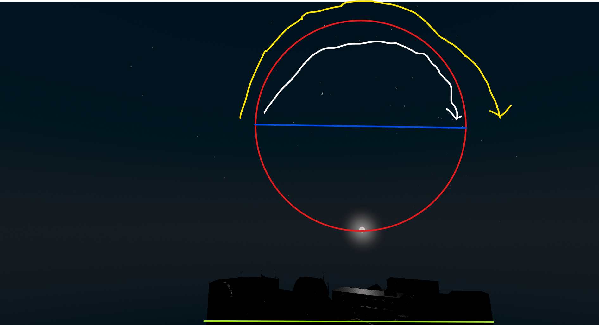
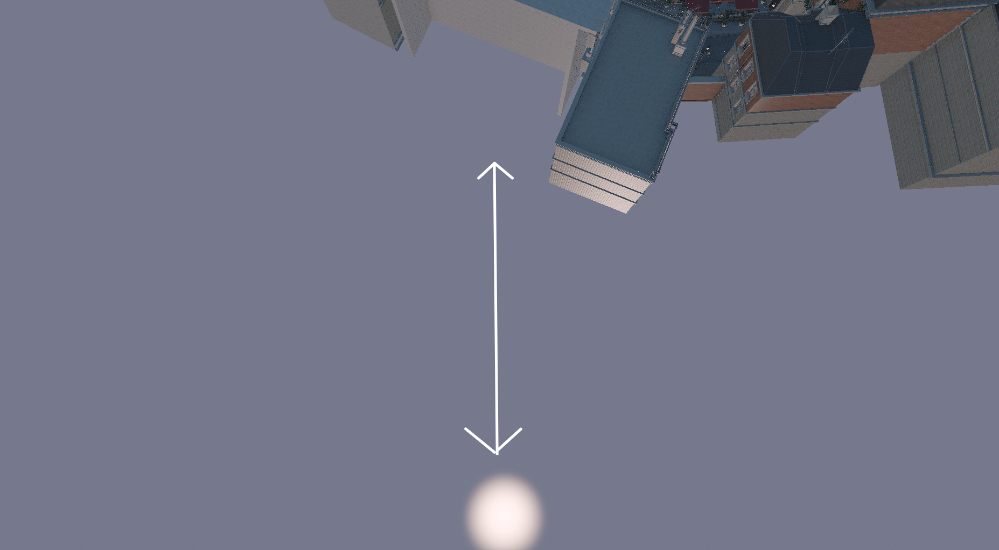

# Three-Band Time-of-Day Sky v1 Postmortem

Three-Band Time-of-Day Sky v1 is a retired experiment. It is not suitable for
integration because the celestial-motion model never passed product validation.
The exact rejected implementation remains available for inspection, while this
record preserves the useful atmosphere, moon, star, and integration lessons
without presenting the experiment as active work.

## Outcome

The experiment attempted to replace the procedural backdrop with a continuous
three-band time system. It added independent sunrise and sunset palettes,
progressive night darkness, automatic sun and moon replacement, directional-
light synchronization, a detailed moon, deterministic clustered stars, and one
control for all celestials.

The renderer built and its reference suite passed, but the central orbit never
looked or behaved correctly. Early paths rotated around the wrong axis or spent
most of their motion below the scene. A later camera-relative path followed the
view, teleported as the camera moved, and appeared to change planes. The final
fixed-world formulation was internally consistent but still failed the user's
visual evaluation. No version received product acceptance.

Retirement is therefore the correct outcome. A future experiment may reuse
isolated components, but it should not continue tuning this orbit implementation.

## Archive Identity

- Lineage base: `3087874cc89853eeecaa3c81e24d4ca49b6aa0a1`
  (`feat: add collision-aware camera modes`).
- Exact rejected implementation checkpoint:
  `c58956327d5cca26f6a36d20daf4d5d2e03cf74f`.
- Archive branch:
  `archive/three-band-time-of-day-sky-v1-3087874`.
- Last camera-relative candidate title: `time-3087874-2059`.
- Last fixed-world candidate title: `orbit-3087874-2128`.

The runtime titles contain the dirty build's embedded base commit, not the later
checkpoint SHA. The checkpoint records the exact source that produced the last
candidate; the archive branch adds only retirement documentation and evidence.
The archive branch is published for inspection. The rejected implementation was
never merged into or promoted as Canonical.

At retirement, the experiment base was three first-parent commits behind the
then-current `origin/main` and eight commits behind in the complete ancestry
graph. A successor must select the newest Canonical verified checkpoint at that
future time rather than treating this archive as a base.

## Intended Product Contract

The requested experience combined:

- a continuous `0–24` **Time** control;
- independent horizon, middle, and zenith atmosphere bands;
- warm sunrise and sunset transitions;
- increasing darkness toward midnight without blue ambient fill;
- automatic replacement between sun and moon;
- directional-light angle and irradiance synchronized with the active body;
- a detailed, adjustable moon;
- clustered stars with varied but restrained sizes; and
- one **Enable Celestials** control for stars, sun, moon, halo, and direct light.

The unresolved requirement was deceptively small: the active body had to move
along an intuitive, stable left-to-right sky arc, meet the scene horizon, remain
world anchored while the camera moved, and hand off cleanly to the other body.

## Reconstructed Development Chronology

Intermediate orbit revisions were not committed separately. This chronology is
reconstructed from the task feedback, retained screenshots, and final source.

1. **Night-Mode Prototype:** The first implementation added a three-band sky,
   stars, and a soft moon. Follow-up tuning addressed day color, night brightness,
   scene tint, halo size, moon appearance, star variation, control order, and
   coupling moon energy to directional-light irradiance.
2. **Continuous Time Expansion:** A single time control replaced the explicit
   night toggle and began moving the directional light and active body. The
   initial rotation used the wrong orbital frame, traversed below the floor, and
   allowed each body to continue through an unwanted full circle.
3. **Screen-Presentation Arc:** The desired left-horizon-to-right-horizon curve
   was encoded in normalized screen coordinates and converted through the live
   camera every frame. This made the body a function of gaze, FOV, and aspect
   ratio. Camera movement relocated it, and the downward-pitched default camera
   mapped much of the nominal upper arc into negative world elevation.
4. **Fixed Y-up Semicircle:** The last revision removed live-camera inputs and
   used one fixed diagonal Y-up world plane. Unit tests proved a unit-length
   upper semicircle, a time-zero zenith, and the intended Donut light-direction
   sign. The resulting candidate still did not match the expected scene motion
   and was rejected without further tuning.

## The Unresolved Horizon Contract

The experiment used the word “horizon” for three different things:

- the mathematical world horizon where a direction has `Y = 0`;
- the camera's view horizon, which changes with camera orientation; and
- the visible bottom of the loaded GLB composition, which is an occlusion and
  framing boundary rather than an infinite sky direction.

Those constraints cannot all be identical for a freely moving camera. A body
fixed to the bottom of the screen necessarily follows the view. A body fixed in
world space naturally leaves the viewport when the camera looks elsewhere. The
experiment alternated between these models before one was explicitly selected
and visually accepted.

The final implementation then replaced calibration with a hard-coded assumption:
its horizontal orbit basis was the diagonal `(1, 0, 1) / sqrt(2)`. That basis
matched a derivation from the default framing camera, but the product requirement
was about the perceived path through the actual scene. Algebraic agreement with
one camera basis did not establish that perceptual contract.



## Why the Camera-Relative Path Failed

The rejected screen-presentation path reconstructed a world ray from the active
camera's forward, right, and up vectors plus the current FOV and aspect ratio.
It therefore changed whenever the camera changed. The path was also an offset
cone projection, not one immutable world-space orbit plane.

With the default camera pitched downward, its lower screen endpoints mapped to
negative world Y. This explains the captured body appearing below the scene even
though the authored screen curve looked like an upper arc.



## Why the Fixed-World Path Was Not Enough

The fixed-world revision corrected the camera dependence and sign ambiguity. It
generated the body ray from time alone, kept every sampled point at nonnegative
world Y, stored the opposite photon direction in Donut's directional light, and
let the sky pass recover the body direction.

Those are valid engineering invariants, but they answered only whether the path
was stable and above the mathematical horizon. They did not prove where that
path appeared against Bistro geometry, whether its projected motion read as
left-to-right from the accepted view, or whether its scale and timing matched the
annotated expectation. The final candidate was rejected by direct observation,
which outweighs its internal mathematical consistency. No separate screenshot
of that final candidate was retained.

## Why Automated Verification Passed

The final Release build succeeded and all eight registered tests passed. The
procedural-sky reference test sampled the complete time cycle and hundreds of
orbit points. It checked:

- sun and moon classification and handoff times;
- a moon at the mathematical zenith at Time `0`;
- finite, unit-length directions with nonnegative world Y;
- one immutable plane and monotonic left-to-right projection;
- opposite body-ray and photon-direction signs;
- palette anchors, night depth, star bounds, and celestial gating.

Those checks did not load Bistro, project the orbit through an accepted camera,
compare against a saved visual reference, exercise camera movement while
tracking the same world direction, or measure the body's relationship to visible
scene geometry. Shader compilation and CPU algebra demonstrated technical
coherence, not product correctness.

## Reusable Engineering

The archive contains components worth evaluating independently:

- three-band atmosphere weights and shader evaluation;
- time wrapping and palette interpolation;
- independently authored sunrise and sunset anchors;
- zero-ambient night lighting as a way to avoid tinting unlit materials;
- a self-contained procedural lunar surface;
- moon energy controlled by the active directional-light irradiance;
- deterministic clustered stars with a bounded size distribution;
- unified celestial gating;
- frame-local preservation of authored daylight state; and
- first-party pass, constant-buffer, shader, CMake, and reference-test seams.

None of the visible palettes should be called accepted merely because their
implementation is reusable. The experiment ended before holistic visual
acceptance.

## Components to Redesign

Do not carry these contracts into a successor unchanged:

- `GetProceduralSkyCelestialDirectionToLight`;
- the hard-coded diagonal orbit basis;
- tests that define `x == z` as product correctness;
- any NDC-to-live-camera celestial conversion;
- an assumption that the bottom of a GLB is a world horizon; or
- active-design claims that a mathematically bounded orbit is scene-correct.

## Sequencing Failure

The experiment completed moon surface detail, clustered star distributions,
palette tuning, halo parity, UI restructuring, and broad reference assertions
before one minimal orbit had passed a saved visual test. These pieces were
individually reasonable, but their early completion made the central failure
more expensive to abandon and encouraged further tuning around an unproven
coordinate model.

## Required Order for a Successor Experiment

1. **Select the Base:** Start from the newest Canonical verified checkpoint, in
   a new branch and isolated worktree.
2. **Define One Horizon:** Choose and document the world, view, and occlusion
   semantics before writing time or lighting logic.
3. **Build an Unlit Orbit Probe:** Render only a debug arc and markers for start,
   midpoint, and finish. Do not add palettes, stars, moon detail, or lighting.
4. **Save an Accepted Camera:** Record one scene, camera transform, FOV,
   resolution, and annotated target capture.
5. **Prove Camera Independence:** Rotate, translate, pitch, change camera modes,
   and return to the saved pose. The same time value must recover the exact same
   world direction without teleporting.
6. **Approve Key Times:** Show `06:00`, `12:00`, `18:00`, and `00:00`, plus both
   handoffs, before expanding the implementation.
7. **Document the Sign Chain:** Record body ray, photon direction, Donut light
   direction, and shader direction in one small table and test it.
8. **Integrate Direct Light:** Only after the unlit path is accepted should time
   write the directional light.
9. **Add Atmosphere Incrementally:** Restore day parity first, then sunrise and
   sunset, then neutral darkness, with a capture after each addition.
10. **Add Secondary Celestials Last:** Moon detail, stars, halo controls, and UI
    polish come only after the orbit and atmosphere are accepted together.

## How to Inspect or Reuse the Archive

The exact failed implementation is checkpoint `c589563`. Inspect a component
without restoring the entire branch, for example:

```powershell
git show c589563:src/procedural_sky_ps.hlsl
git show c589563:src/procedural_sky_settings.h
```

To resume the exact archived state for diagnosis, create a detached worktree
from the immutable checkpoint. Do not use it as the base for a successor:

```powershell
git worktree add --detach <diagnostic-path> c589563
```

For a clean successor, select the newest Canonical verified checkpoint at that
future time and create a new branch from it. Extract only individually reviewed
components from this archive after the bare orbit probe passes.
